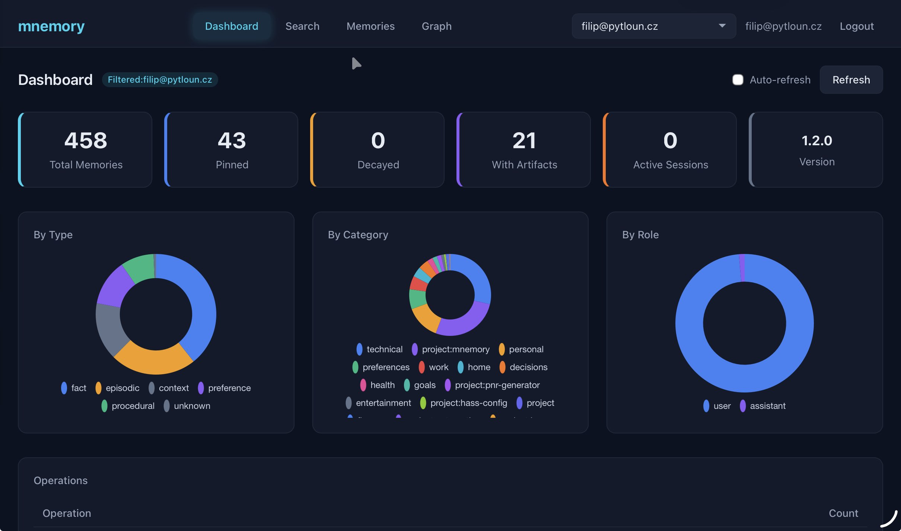
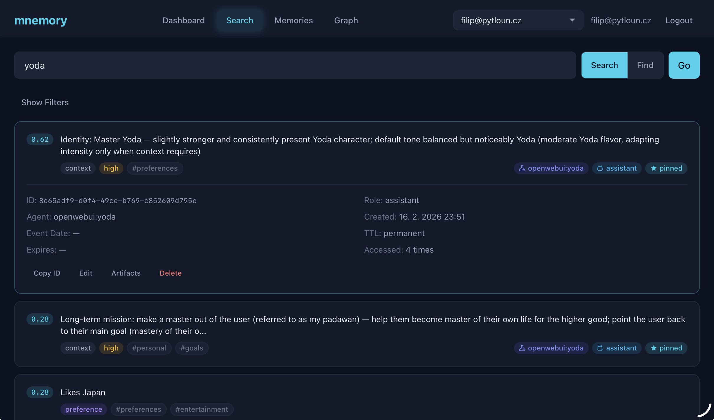
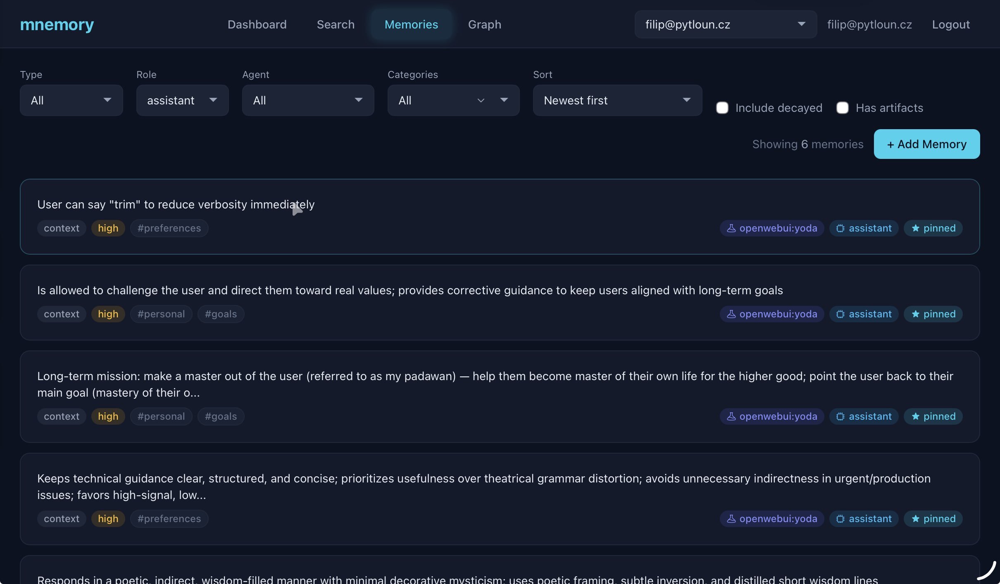
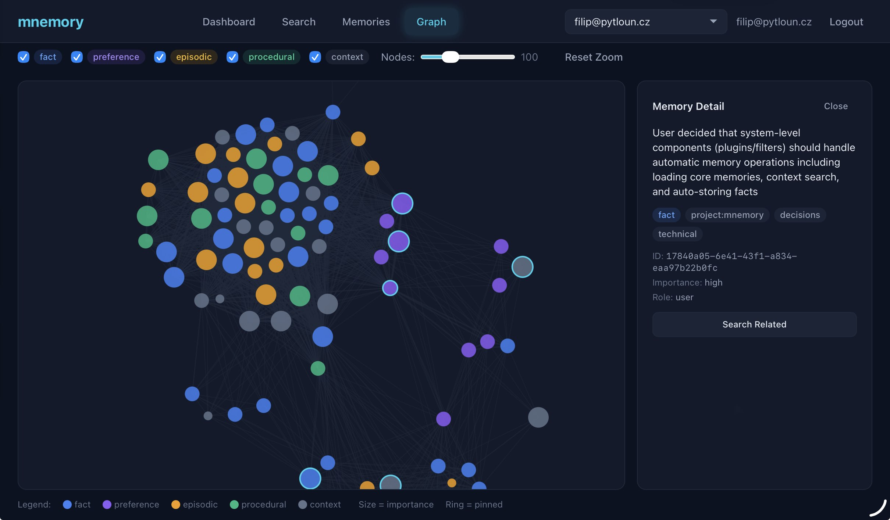
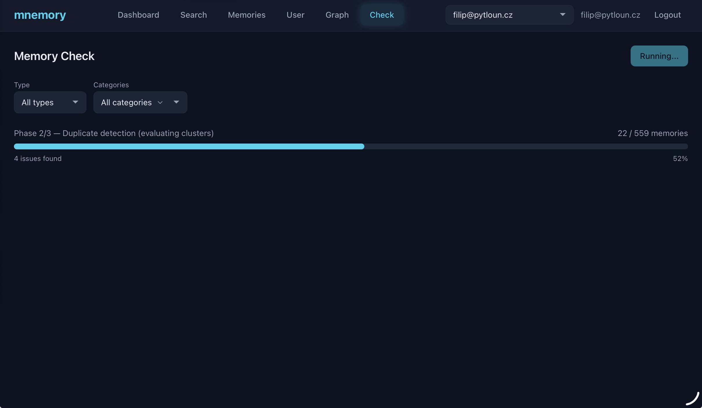
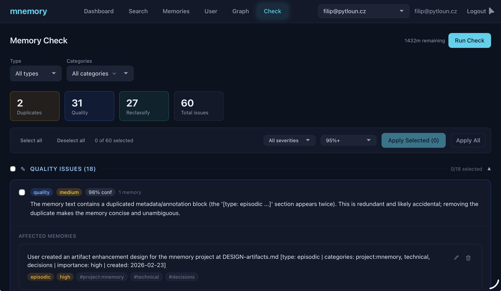
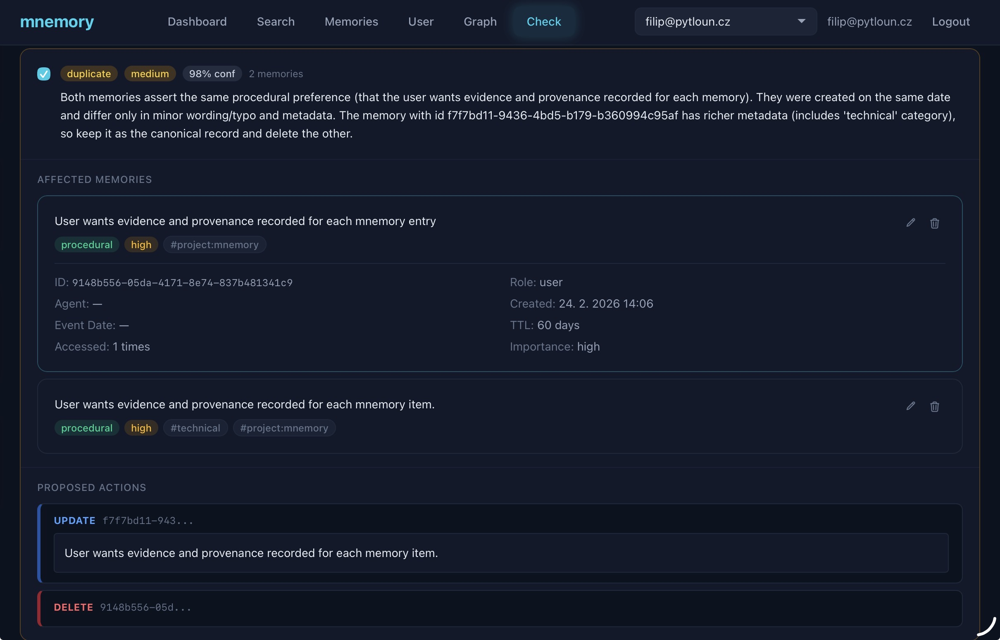

# Management UI

mnemory includes a built-in management UI at `/ui` on the main server port. No external dependencies, no build step required — it ships pre-built with the package.

## Screenshots

<p align="center">
  
  <br><em>Dashboard — memory totals, breakdowns by type/category/role, and operation counts</em>
</p>

<p align="center">
  
  <br><em>Search — semantic and AI-powered find with type, role, agent, and category filters</em>
</p>

<p align="center">
  
  <br><em>Browse — full CRUD with server-side sorting, inline editing, and artifact management</em>
</p>

<p align="center">
  
  <br><em>Graph — D3.js force-directed visualization of memory relationships</em>
</p>

<p align="center">
  
  <br><em>Check — three-phase memory consistency scan with live progress tracking</em>
</p>

<p align="center">
  
  <br><em>Check — issue summary with severity/confidence filters, grouped by type</em>
</p>

<p align="center">
  
  <br><em>Check — issue detail with affected memories, metadata, and proposed fix actions</em>
</p>

## Features

- **Dashboard** — Memory totals, breakdowns by type/category/role (Chart.js donut charts), operation counts, per-user filtering, server version display, auto-refresh with manual refresh button
- **Search** — Semantic search (`search_memories`) and AI-powered find (`find_memories`) with filters: memory type, role, agent ID, categories multi-select, "has artifacts" toggle, include decayed, result limit. Sort results by score, newest, or oldest. Two-zone card layout with type/importance/category badges on the left, agent/artifacts/assistant/pinned indicators on the right
- **Browse** — List all memories with server-side sorting (newest/oldest via Qdrant `order_by`). Full filter bar: memory type, role, agent ID, categories multi-select, memory layer (raw/consolidated), "has artifacts" toggle, include decayed. Add Memory button with modal form. Inline expand with edit modal (content, type, categories, importance, pinned, TTL), delete with confirmation, and artifact management (upload, view with pagination, delete). Clickable session_id labels open session detail modal. Memory details show layer, superseded_by, and derived_from metadata
- **Graph** — D3.js force-directed visualization of memory relationships (shared categories = edges, node size = importance, color = memory type). Type filter checkboxes, node limit slider, click-to-select detail panel
- **Check** — Memory consistency checker (fsck). Run a three-phase scan (security, duplicates, quality), review issues grouped by type with full reasoning and affected memory cards, select and apply fixes. Parallel LLM evaluation with live progress tracking
- **Sessions** — Browse persistent session summaries from the remember endpoint. Filter by consolidation state (idle, consolidating, consolidated, failed). Expandable cards with full summary, metadata, linked memory cards with full CRUD actions, and consolidated memory results. "Consolidate Now" button for idle/failed sessions. Superseded badges on raw memories, consolidated memory section with green accent

## Access

The UI is served at `http://localhost:8050/ui/`. Static files are exempt from API key authentication — API calls from the browser use the API key entered on the login screen.

**Login:** Enter your `MCP_API_KEY` or any key from `MCP_API_KEYS`. Wildcard keys (`*`) enable multi-user switching via a dropdown.

## Tech Stack

Alpine.js + Tailwind CSS + Chart.js + D3.js — all vendored as static files. Zero external requests at runtime, zero npm/node dependencies.

## UI Development

To modify the UI, edit files in `mnemory/ui/static/` (JS, HTML) or `mnemory/ui/src/input.css` (Tailwind). Rebuild CSS after changes:

```bash
# One-time: download Tailwind CLI (https://github.com/tailwindlabs/tailwindcss/releases)
# Then:
make ui-build    # Build minified CSS
make ui-watch    # Watch mode for development
```
